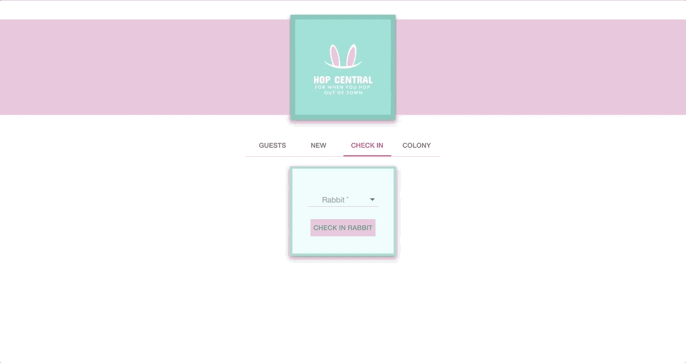

# HOP CENTRAL
### FOR WHEN YOU HOP OUT OF TOWN

Hop Central was created as a tool for a rabbit hotel service employees. The application is used to manage rabbits and owners being checked in to the hotel.

* User's of this application allows for adding, editing, and removing the rabbits and owners.

# Features

## Managing Current Guest

## Managing Create Owner & Rabbit

## Managing Create Owner & Rabbit

## Managing Create Owner & Rabbit

## Design & Functionality

The application is meant for hotel service employees to use a single page tool with multiple views. Content should appear all in a single interface to user. When adding a new owner or rabbit they do not need to nagivate to a different page, build fluid process for the user.

## Technologies Used

AngularJS
Material-UI
Node.js
Express
PostgreSQL
Sweet Alerts
Heroku

## Authors
#### Kam Kubesh
